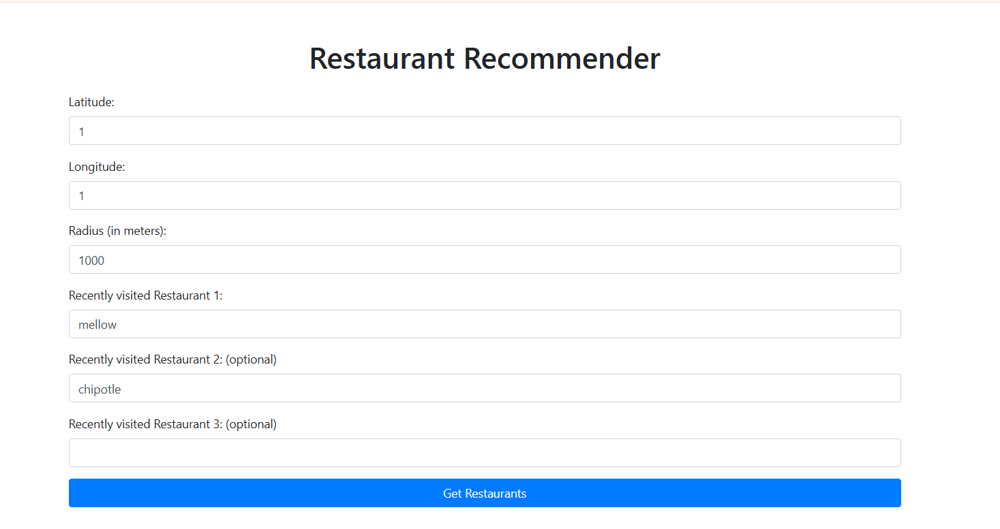
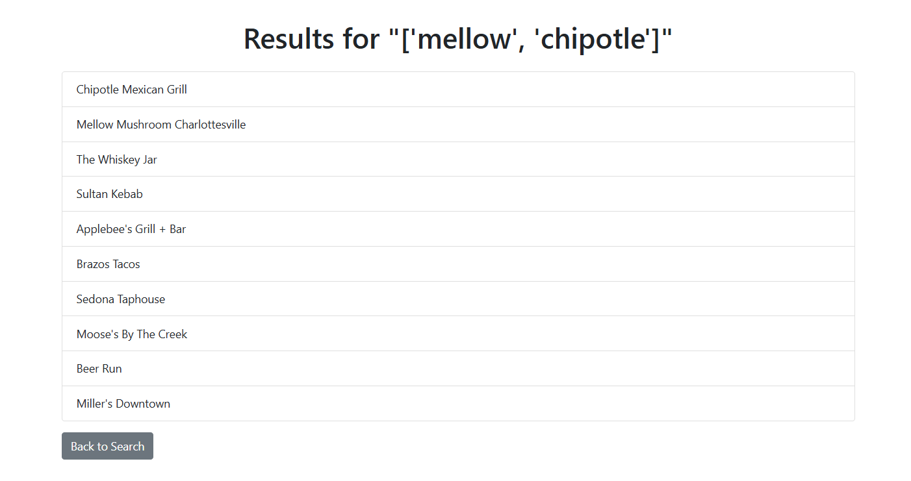

# Restaurant Recommender

## Overview
The Restaurant Recommender is a web application built using Flask that allows users to input their recently visited restaurants and receive recommendations for similar dining options. The application utilizes a dataset of restaurants from Google Place API, including their ratings and features, to provide personalized suggestions.

## Features
- User-friendly interface for inputting restaurant preferences.
- Recommendations based on user input using a similarity algorithm.
- Integration with a dataset of restaurants, including ratings and various features.
- Responsive design using Bootstrap for a better user experience.

## Technologies Used
- **Flask**: A lightweight WSGI web application framework for Python.
- **Pandas**: A data manipulation and analysis library for Python.
- **Scikit-learn**: A machine learning library for Python, used for calculating cosine similarity.
- **FuzzyWuzzy**: A library for string matching, used to find the closest restaurant names.
- **Bootstrap**: A front-end framework for developing responsive web applications.

## Installation
1. Clone the repository:
   ```bash
   git clone https://github.com/yourusername/restaurant-recommender.git
   cd restaurant-recommender
   ```

2. Create a virtual environment:
   ```bash
   python -m venv venv
   ```

3. Activate the virtual environment:
   - On Windows:
     ```bash
     venv\Scripts\activate
     ```
   - On macOS/Linux:
     ```bash
     source venv/bin/activate
     ```

4. Install the required packages:
   ```bash
   pip install -r requirements.txt
   ```

5. Ensure you have the dataset `c.csv` in the `notbooks` directory.(fixing it now so that it will be automatically calculateed)

## Usage
1. Run the Flask application:
   ```bash
   python app.py
   ```

2. Open your web browser and navigate to `http://127.0.0.1:5000/`.

3. Input your recently visited restaurants and other details, then click "Get Restaurants" to receive recommendations.






## Dataset
The application uses a CSV file (`c.csv`) containing restaurant data, including:
- Name
- Rating
- Price Level
- User Ratings Total
- Various features (e.g., bakery, bar, cafe, etc.)


## Acknowledgments
- [Flask Documentation](https://flask.palletsprojects.com/)
- [Pandas Documentation](https://pandas.pydata.org/)
- [Scikit-learn Documentation](https://scikit-learn.org/)
- [FuzzyWuzzy Documentation](https://github.com/seatgeek/fuzzywuzzy)
- [Bootstrap Documentation](https://getbootstrap.com/)
